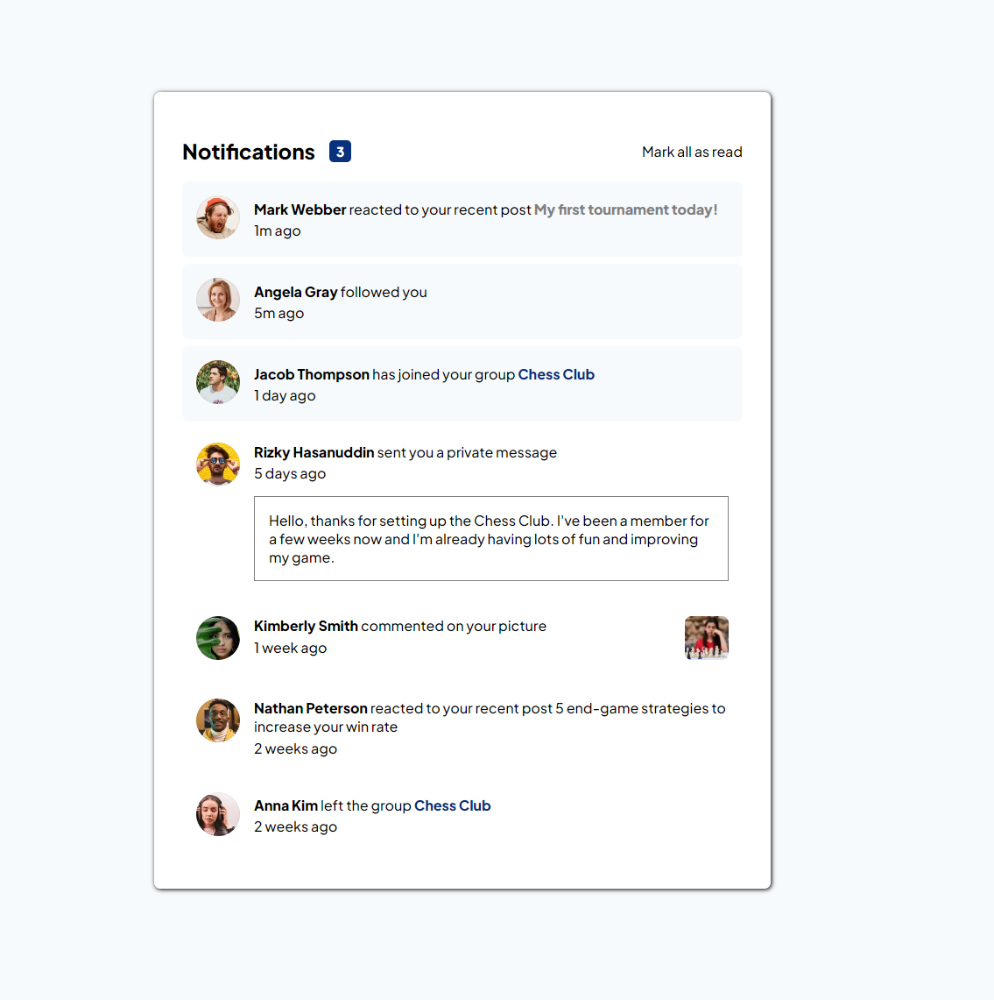

# Frontend Mentor - Notifications page solution by dlxzeus777

## Welcome! 👋

Thanks for checking out this front-end coding challenge.

## The challenge

Your users should be able to: 

- Distinguish between "unread" and "read" notifications
- Select "Mark all as read" to toggle the visual state of the unread notifications and set the number of unread messages to zero
- View the optimal layout for the interface depending on their device's screen size
- See hover and focus states for all interactive elements on the page

## Built with:

- HTML5
- CSS
- CSS Flexbox
- Javascript

## What I learned

I didn't know how to check if an html element has a certain class so I used google and searched up 'how to check if an html element has a class in javascript' and I came across this 'element.classList.contains()'. Well I knew that there is a contains() method but I just didn't know you could use it on classes. I learned that it's a real thing and it's really useful.

## In this project:

- You can click on the notifications to make them 'read' or 'unread' and the notifications number will update according to how many unread messages you have.